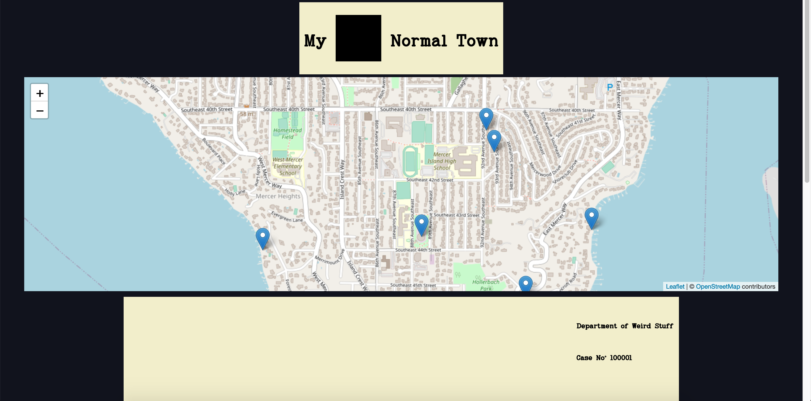

# Weird Town

Weird Town is a community collaborative creative writing application. with it, users can write spooky stories that take place in their local communities, and work together to craft local folklore.

## Getting Started

Clone this repo with the following command:

```
$ git clone https://github.com/E-Schaferer/WeirdTown.git
```

## Functionality

* When the site is first loaded it will generate the map along with all retrieved marker location data. The markers will then be placed on the map according to their location data.


* Clicking on a marker on the map will bring up the story stored in the database that is associated with that marker




* Clicking on an area of the map that does not have an associated marker will place a temporary one and prompt the user to write their own story. The user will then fill out the form that will make up the story they write.


* Submitting a completed form will then pin that marker to the map by adding its coordinates and form data to the database.


## Technologies Used

* React
* React-DOM
* React-Leaflet
* Leaflet
* MySQL
* Axios
* Nodejs
* Express
* Eslint
* Babel
* Webpack

## Author

Evan Schafer
* [Github Profile](https://github.com/E-Schaferer)
* [Linkedin Profile](www.linkedin.com/in/schaferer)
